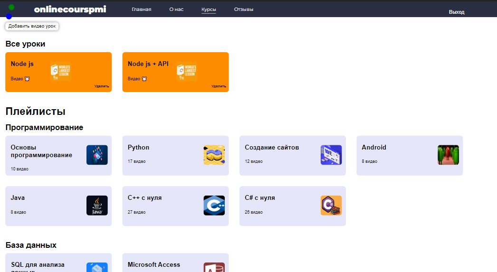

# Online Cours PMI
---
The PMI Online Course is a web-based application where PMI (Applied Mathematics and Computer Science) students can learn from video lessons. This web application collects all the lessons in the subjects completed in the last year of study. Teachers can also upload new video lessons.

__Techonology__

__client__
- React
- React-redux
- React-router
- Axois
- Formik, Yup
- Jwt-decode

__server__
- Nodejs
- Express
- Mysql2
- Nodemon
- Body-parser

__Install__
Use the git to clone the project to your local machine.

    https://github.com/BEGIM-bem/Online-cours-pmi.git

__client__

    cd client
    npm install
    npm start

__server__

     cd server
     npm install

     You need to set the Database(Workbench) and in the server folder (index.js in the line on line 11 change the table name to yours)

     npm run devStart

